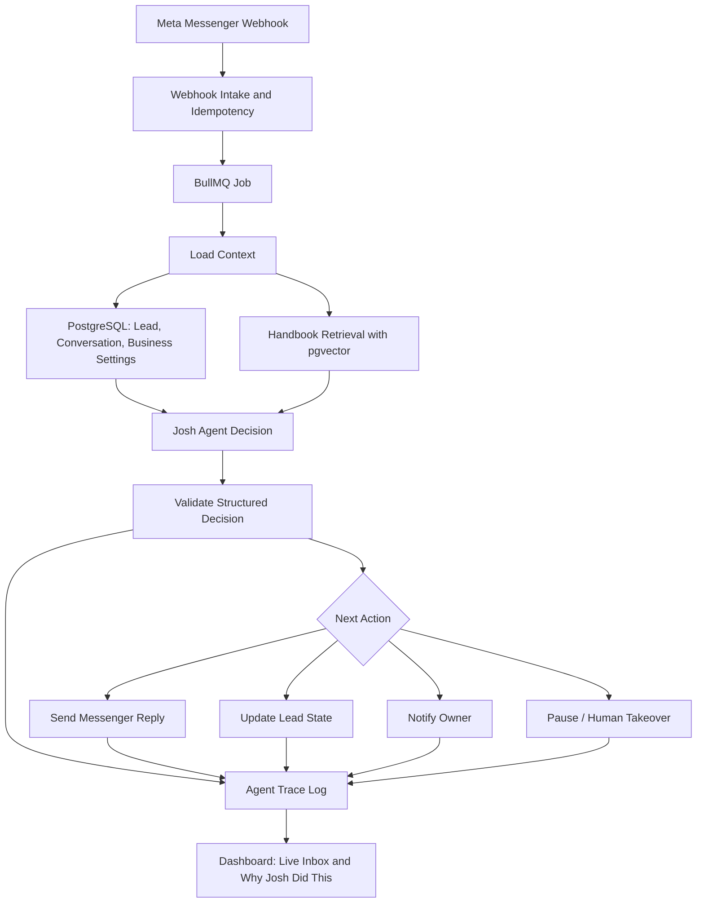

# Practical Analysis: Google AI Agents Guide Applied to Rocketeerio’s Josh

**Prepared for:** Rocketeerio  
**Product context:** Josh, an AI sales agent for Facebook Messenger lead qualification  
**Prepared by:** Manus AI  
**Date:** May 10, 2026

## Executive Summary

Rocketeerio is already building in the direction described by Google’s AI agents guide. Josh is not merely a chatbot; it is an **agentic workflow** wrapped inside a lead-response product. It receives a business goal, interacts with a lead over Messenger, uses business-specific context from the Handbook, determines whether the lead is qualified, and alerts the owner when human closing is appropriate. That maps closely to the guide’s definition of an AI agent as a system that combines a reasoning model, tools, orchestration, memory, grounding, and a production runtime.

The most important conclusion for Rocketeerio is that the next leap should not be “make the prompt bigger.” The practical path is to turn Josh from a prompt-driven responder into a **tool-using, memory-aware, observable sales agent**. In MVP terms, this means adding structured qualification state, tool/function calling, retrieval over the Handbook, explicit escalation logic, evaluation traces, and a basic AgentOps loop before adding more complex multi-agent architecture.

The current stack is appropriate for an MVP. Next.js on Vercel, Node.js with BullMQ on Railway, PostgreSQL, OpenAI, and Meta Graph API can implement most of the guide’s recommendations without moving to Google Cloud. Google’s guide recommends managed agent runtimes such as Vertex AI Agent Engine or Cloud Run, managed retrieval such as Vertex AI Search/RAG Engine, and strong observability/evaluation. For Rocketeerio, these are useful reference patterns rather than immediate migration requirements. The highest-ROI implementation is to keep the current stack and add the missing agentic layers intentionally.

| Founder decision | Recommendation | Why it matters now |
|---|---:|---|
| Should Rocketeerio rebuild around Google ADK or Vertex AI Agent Engine? | **No, not yet.** Borrow the patterns, not necessarily the platform. | The current stack is good enough for MVP speed. Migration adds complexity before product-market fit. |
| What should be built next? | **Structured agent state, Handbook retrieval, qualification scoring, tool/function calls, and evaluation logs.** | These directly improve lead quality, reliability, and founder trust. |
| Should Josh become multi-agent? | **Only lightly.** Start with modular internal roles, not separate deployed agents. | Full multi-agent systems are overkill for early MVP unless there are clearly separable workflows. |
| Should Rocketeerio fine-tune? | **Not first.** Use grounding and evaluation before fine-tuning. | Fine-tuning changes behavior/style; it does not guarantee factual grounding or correct business-specific answers. |
| What is the biggest operational risk? | **Unobservable non-determinism.** | If Josh says the wrong thing, fails to escalate, or invents an offer, the team needs traces, policies, and replayable evaluations. |

## 1. The Guide Concepts Most Relevant to How Josh Works Today

The guide’s most relevant concept is that an AI agent is more than an LLM response. It is a system that combines a model, tools, orchestration, context, memory, grounding, and runtime reliability. Josh already has several of these pieces, but some are implicit rather than explicit.

Josh today appears to be an **LLM-powered conversational agent with a dynamic prompt builder**. The Messenger webhook provides the event trigger. BullMQ handles asynchronous processing. PostgreSQL likely stores users, businesses, conversations, settings, and lead records. The OpenAI API generates responses. The Handbook functions as business-specific context, training, or configuration. The dashboard provides operational visibility through Live Inbox, Handbook, and Josh Settings.

| Google guide concept | Josh equivalent today | Current maturity | Practical implication |
|---|---|---:|---|
| **Model** | OpenAI API generating Josh’s replies | Medium | Josh has the “brain,” but model choice should be task-specific rather than one model for everything. |
| **Tools** | Meta webhook, message send API, database operations, owner alerts | Low to medium | Tools likely exist in backend code, but Josh should call explicit, typed functions rather than relying only on prompt instructions. |
| **Orchestration** | BullMQ job flow plus prompt builder | Medium | The queue gives operational orchestration, but Josh needs agent-level orchestration: qualify, ask next question, decide, escalate, stop. |
| **Short-term memory** | Messenger thread history and recent conversation context | Medium | This is essential for avoiding repeated questions and maintaining continuity. |
| **Long-term memory** | Handbook, business settings, historical conversations | Low to medium | This should become a retrieval-backed knowledge layer, not just static prompt injection. |
| **Grounding** | Handbook content inserted into prompts | Low | Josh needs retrieval and source-aware constraints so it answers from business-approved information. |
| **Runtime** | Railway worker/API, Vercel frontend, BullMQ | Medium | This is a valid MVP runtime, but it needs stronger retries, idempotency, timeouts, and observability. |
| **AgentOps** | Dashboard and logs, if present | Low | Production agents need traces of prompts, retrieved context, tool calls, outputs, decisions, latency, and failure modes. |

The guide’s example of **complex lead qualification** is directly applicable. It describes a sales agent that enriches a lead, searches a CRM, and decides whether to assign the lead to a sales representative or a nurture sequence. Rocketeerio’s version is similar but Messenger-first: Josh receives the lead, engages quickly, asks qualifying questions, decides readiness, and alerts the business owner.

> The key translation is this: Josh should not be treated as a “chat reply generator.” Josh should be treated as a **lead-state machine plus LLM reasoning layer** that uses tools and business context to move a lead toward a qualified handoff.

## 2. Patterns and Architectures from the Guide That Could Improve Josh

### 2.1 ReAct-style orchestration for lead qualification

The guide presents ReAct as a loop of **Reason → Act → Observe**. For Josh, this should become the core mental model for every inbound Messenger event. Today, the system may build a prompt from business settings and conversation history, ask the LLM for a response, and send it. That works for basic replies, but it can become fragile when Josh must decide whether to ask another question, qualify the lead, update CRM-like state, or alert the owner.

A practical Josh ReAct loop would look like this:

| Step | Josh behavior | Example |
|---|---|---|
| **Reason** | Determine the lead’s current stage and missing qualification fields. | “The lead wants pricing but has not provided service area or timeline.” |
| **Act** | Use a tool or take a controlled action. | `update_lead_stage`, `retrieve_handbook_policy`, `send_messenger_reply`, `notify_owner`. |
| **Observe** | Read the result of the action. | “Lead stage updated; Handbook says pricing depends on job size; owner notification queued.” |
| **Respond or continue** | Send the next best message or escalate. | “Could you share the project location and when you’d like to start?” |

This does not require adopting Google ADK. Rocketeerio can implement the same pattern in Node.js by giving the model a set of typed tools and forcing the output into a structured JSON decision. The key is that Josh should produce both a customer-facing message and a machine-readable decision.

A recommended response schema would be:

```json
{
  "public_reply": "Absolutely — we can help with that. What city is the project in?",
  "lead_stage": "qualifying",
  "qualification_fields": {
    "intent": "service_request",
    "location": null,
    "timeline": null,
    "budget": null,
    "contact_info": "known_from_messenger"
  },
  "confidence": 0.82,
  "next_action": "ask_missing_field",
  "owner_alert": false,
  "risk_flags": []
}
```

This single change would make Josh more reliable because the backend can validate the decision before sending a message or alerting the owner.

### 2.2 Deterministic workflow agents for predictable sales flows

The guide distinguishes flexible LLM agents from deterministic workflow agents such as sequential, parallel, and loop patterns. This is highly relevant because lead qualification should not be entirely left to an LLM. A small business owner does not want “creative” qualification logic; they want consistent handling of leads.

For Rocketeerio, use deterministic workflow around LLM calls:

| Workflow stage | Deterministic control | LLM role |
|---|---|---|
| Webhook intake | Verify Meta signature, dedupe event, create or update conversation | None |
| Context assembly | Load conversation, lead record, Handbook snippets, business settings | None |
| Message classification | Enforce allowed categories | Classify intent and sentiment |
| Qualification decision | Require schema and thresholds | Fill missing fields and propose next step |
| Response generation | Enforce policies, rate limits, opt-out rules | Write natural Messenger reply |
| Escalation | Apply exact alert rules | Summarize why the lead is ready |
| Logging/evaluation | Persist trace and outcome | None |

The MVP should move toward a **hybrid agent**: deterministic backend for safety and state, LLM for interpretation and conversational nuance. This is exactly the practical trade-off implied by the guide’s discussion of non-deterministic LLM agents versus predictable workflow agents.

### 2.3 Handbook as a grounded knowledge base, not just prompt text

The Handbook is one of Rocketeerio’s most important product surfaces. In the guide’s terminology, it should become Josh’s **long-term knowledge base** and grounding layer. If Handbook data is simply appended to every prompt, Rocketeerio will eventually hit context limits, cost issues, stale answers, and inconsistent instruction following.

A more scalable MVP pattern is to split the Handbook into structured and unstructured knowledge.

| Handbook content type | Storage pattern | Retrieval pattern | Example |
|---|---|---|---|
| Business identity and tone | PostgreSQL columns or JSONB | Always included | Business name, greeting style, banned phrases |
| Qualification criteria | Structured tables/JSONB | Always included in compact form | “Ready to close if service + location + timeline + phone are known.” |
| FAQs and policies | Embeddings/vector search | Retrieve top relevant snippets | Pricing rules, service areas, warranty, booking process |
| Offers and constraints | Structured with validity windows | Deterministic lookup | “Do not offer discounts unless enabled.” |
| Owner preferences | Structured settings | Always included | Alert channel, escalation threshold, quiet hours |

For the MVP, Rocketeerio does not need a separate managed vector database immediately. If PostgreSQL is already in use, **pgvector** is a natural next step. It keeps the architecture simple while enabling RAG-like retrieval over Handbook entries and past approved answers.

The practical build is straightforward: chunk Handbook FAQ/policy sections, embed them, store embeddings in PostgreSQL, retrieve the top 3–5 relevant snippets per lead message, and tell Josh to answer only from those snippets for business-specific facts. This would make Josh significantly safer when asked about pricing, availability, service areas, refunds, guarantees, or booking terms.

### 2.4 Long-term memory for business and lead personalization

The guide separates long-term knowledge, working memory, and transactional memory. Rocketeerio already has PostgreSQL, which can cover much of this for MVP, but the conceptual split matters.

| Memory type from guide | Josh implementation | Recommended MVP data objects |
|---|---|---|
| **Working memory** | Current Messenger conversation context | Recent messages, current stage, missing qualification fields |
| **Long-term knowledge** | Handbook and historical business facts | FAQs, policies, services, business preferences, approved response examples |
| **Persistent lead memory** | Lead profile across conversations | Name, contact, intent, budget, timeline, objections, qualification status |
| **Transactional memory** | Audit log of actions | Every sent message, owner alert, stage change, tool call, webhook event |

This is important because Josh’s value comes from continuity. A lead may message today, disappear, and return next week. Josh should remember that the lead previously wanted a roof repair in Austin, asked about weekend availability, and was waiting for a quote. This should not rely on raw conversation history alone; Rocketeerio should maintain a compact **lead memory summary** updated after each meaningful exchange.

A practical schema addition would be:

| Table/object | Purpose |
|---|---|
| `lead_profiles` | Stores canonical qualification fields and current status. |
| `conversation_summaries` | Stores rolling summaries so Josh does not need all prior messages. |
| `agent_action_logs` | Stores model decision, tool calls, inputs, outputs, latency, and errors. |
| `handbook_chunks` | Stores retrievable business knowledge snippets and embeddings. |
| `qualification_rules` | Stores business-specific close-readiness criteria. |

### 2.5 Multi-model routing to control latency and cost

The guide warns against using the most capable model for every task. This is very actionable for Rocketeerio because Messenger lead response is latency-sensitive and cost-sensitive. Josh promises replies in under 60 seconds, but the user experience should ideally be much faster whenever possible.

Rocketeerio should route different tasks to different model configurations.

| Task | Model strategy | Notes |
|---|---|---|
| Webhook dedupe and validation | No LLM | Pure backend logic. |
| Intent classification | Cheap/fast model | Classify “new lead,” “pricing,” “booking,” “spam,” “complaint,” etc. |
| Qualification extraction | Cheap or mid-tier model with structured output | Extract location, service, timeline, budget, urgency. |
| Customer-facing reply | Mid-tier model | Needs tone, empathy, and business context. |
| Escalation summary | Cheap model | Summarize for owner in a consistent format. |
| Difficult objections or angry leads | Stronger model | Use only when sentiment/risk requires better reasoning. |

This keeps Josh economical while preserving quality where it matters. A simple first version can use one default OpenAI model for generation and a cheaper model for classification/extraction.

## 3. Specific Recommendations to Make Josh Smarter, More Reliable, and More Capable

### Recommendation 1: Convert Josh’s output into a structured decision object

The most important near-term change is to stop treating the model output as only text. Josh should return a validated object containing the public reply, lead state updates, confidence, escalation decision, and risk flags. The backend should then decide what to send, what to store, and whether to alert.

| Benefit | Why it matters |
|---|---|
| Fewer accidental owner alerts | The backend can require required fields before alerting. |
| Better dashboard state | Live Inbox can show why Josh thinks the lead is qualified. |
| Easier debugging | Each decision is inspectable and replayable. |
| Safer automation | The system can block risky actions before they reach the lead. |

### Recommendation 2: Implement a qualification state machine

A lead should have an explicit state, independent of the conversation text. For example:

| State | Meaning | Josh action |
|---|---|---|
| `new` | First inbound message received | Respond quickly and identify intent. |
| `engaged` | Lead replied meaningfully | Ask first qualification question. |
| `qualifying` | Josh is collecting required fields | Ask only for missing fields, one or two at a time. |
| `qualified` | Required fields meet threshold | Alert owner with summary and suggested next move. |
| `needs_human` | Sensitive, confused, angry, or high-value lead | Escalate immediately. |
| `nurture` | Not ready yet | Provide helpful response and set follow-up. |
| `closed_lost_or_spam` | Spam, irrelevant, or opted out | Stop automation. |

This state machine should live in PostgreSQL and be enforced by backend logic. The LLM can recommend a state transition, but the backend should validate it.

### Recommendation 3: Add RAG over the Handbook with pgvector

The Handbook should become a retrieval source. A practical MVP implementation can use PostgreSQL with pgvector instead of introducing a new service. Each Handbook section should have metadata such as business ID, content type, last updated date, and whether it is approved for customer-facing answers.

| Implementation step | MVP detail |
|---|---|
| Chunk Handbook content | Split FAQs, policies, services, and pricing notes into short chunks. |
| Generate embeddings | Use an embedding model when Handbook content changes. |
| Store in PostgreSQL | Use pgvector with metadata filters by business ID. |
| Retrieve per message | Retrieve only relevant snippets for the current lead question. |
| Ground response | Include snippets in the prompt and instruct Josh not to invent facts outside them. |
| Log retrieved snippets | Store snippet IDs in `agent_action_logs` for auditability. |

This is likely the highest-leverage “make Josh smarter” upgrade because it turns each customer’s Handbook into a living knowledge base.

### Recommendation 4: Add tool/function calling for controlled actions

Josh should not only generate replies. It should be able to call controlled backend tools. These tools should be narrow, typed, logged, and permissioned.

| Tool | Purpose | Safety rule |
|---|---|---|
| `retrieve_handbook_context(query)` | Fetch approved business knowledge | Read-only. Filter by business ID. |
| `update_lead_profile(fields)` | Save qualification fields | Validate fields and confidence. |
| `set_lead_stage(stage, reason)` | Move lead through pipeline | Allow only valid state transitions. |
| `notify_owner(summary, urgency)` | Alert the business owner | Require qualification threshold or risk flag. |
| `send_messenger_reply(text)` | Send response to lead | Apply policy checks before sending. |
| `pause_automation(reason)` | Stop Josh for this thread | Trigger on opt-out, complaint, or human takeover. |

For MVP simplicity, the LLM does not need fully autonomous access to tools. The backend can run a two-step process: ask the model for a structured proposed action, validate it, then execute safe tools.

### Recommendation 5: Build an AgentOps trace before scaling customer count

Google’s guide emphasizes observability, evaluation, reliability, and responsible operation. This is not enterprise overhead; it is how a small team avoids flying blind. Every Josh interaction should produce a trace.

A useful trace should include:

| Trace field | Why it matters |
|---|---|
| Incoming webhook ID | Enables idempotency and duplicate prevention. |
| Conversation and lead IDs | Connects messages to business outcomes. |
| Prompt version | Shows which prompt generated the behavior. |
| Model and parameters | Supports cost, latency, and quality comparisons. |
| Retrieved Handbook snippet IDs | Proves what Josh used as business context. |
| Structured decision object | Shows stage, confidence, next action, and flags. |
| Tool calls and results | Reconstructs the reasoning-action path. |
| Final sent message | Audits customer-facing output. |
| Latency and token usage | Tracks SLA and unit economics. |
| Human override/outcome | Creates future evaluation data. |

The dashboard should eventually expose a founder-friendly version: “Why Josh said this,” “Why Josh qualified this lead,” and “What information is missing.” This builds trust and reduces support burden.

### Recommendation 6: Create an evaluation set from real Messenger conversations

Rocketeerio should maintain a small but growing test suite of lead conversations. This is the practical version of the guide’s evaluation recommendation. Start with 50–100 anonymized or synthetic-from-real scenarios.

| Evaluation category | Example test |
|---|---|
| Speed-to-lead | Josh responds within target time under queue load. |
| Qualification extraction | Josh correctly extracts service, location, urgency, budget, and contact info. |
| Escalation decision | Josh alerts owner only when threshold is met. |
| Policy grounding | Josh does not invent pricing or guarantees absent from Handbook. |
| Conversation quality | Josh asks concise, natural, non-repetitive questions. |
| Safety | Josh pauses on opt-out, angry complaint, or legal/medical/financial edge cases. |
| Meta reliability | Duplicate webhook events do not send duplicate replies. |

This evaluation set becomes extremely valuable when changing prompts, models, retrieval settings, or qualification logic. It lets Rocketeerio ship improvements without “vibe-testing” in production.

### Recommendation 7: Add human-in-the-loop controls as a product feature

Human-in-the-loop should not be viewed only as safety infrastructure. For Rocketeerio, it is a product feature. Small business owners need confidence that Josh will not overstep.

High-value controls include:

| Control | MVP behavior |
|---|---|
| Human takeover | Owner can pause Josh in a thread from Live Inbox. |
| Approval mode | Optional setting where Josh drafts but does not send for certain lead types. |
| Escalation threshold | Business can choose aggressive, balanced, or conservative qualification. |
| Banned topics/offers | Josh refuses to discuss disabled services, discounts, or unavailable regions. |
| Quiet hours | Josh replies to leads but delays owner alerts unless urgent. |
| “Why this lead?” explanation | Owner sees the fields and reasoning behind qualification. |

## 4. Warnings and Best Practices Rocketeerio Should Follow

### Warning 1: Do not confuse fine-tuning with grounding

The guide explicitly distinguishes fine-tuning from grounding. For Josh, fine-tuning might eventually help with tone or industry-specific conversation style, but it will not ensure that Josh knows a specific business’s services, prices, service area, or policies. Those should come from the Handbook through retrieval and structured settings.

The practical rule is simple: **use RAG and structured settings for facts; use prompting or fine-tuning for style and behavior.**

### Warning 2: Do not let the LLM own business-critical state

Josh can recommend that a lead is qualified, but PostgreSQL should be the source of truth. The backend should validate state transitions, owner alerts, and outbound messages. This prevents a model hallucination from becoming a business event.

### Warning 3: Avoid prompt bloat

As Rocketeerio adds more Handbook fields and settings, the dynamic prompt builder can become large, slow, expensive, and harder to debug. Retrieval and compact structured context are better than inserting everything into the prompt. A practical target is to include only always-needed settings plus the top relevant Handbook snippets.

### Warning 4: Messenger webhooks require idempotency

Meta may deliver duplicate or retried webhook events. Because Josh sends customer-facing messages, duplicate processing can create embarrassing repeated replies. Every inbound event should have an idempotency key, and every outbound reply should be tied to the inbound event or conversation turn that caused it.

### Warning 5: Under-60-second response is not enough as a product promise

Under 60 seconds is operationally useful, but the customer experience should usually feel immediate. The architecture should optimize for a fast first acknowledgement and a thoughtful follow-up if needed. For example, Josh can quickly say, “Thanks — I’m checking that for you,” while a deeper retrieval or qualification process runs if the user asks a complex question.

### Warning 6: Owner alerts must be high precision

If Josh alerts too often, owners will ignore it. If Josh alerts too late, Josh loses the core value proposition. Qualification thresholds should be configurable and measured. Rocketeerio should track alert precision: how often owners mark a Josh-alerted lead as actually worth contacting.

### Warning 7: Keep multi-agent architecture proportional

The guide discusses multi-agent systems, but Rocketeerio should avoid premature complexity. For the MVP, separate “agents” can be internal modules rather than independent services. For example, implement classifier, qualification extractor, response generator, and escalation summarizer as separate prompt/tool chains behind one Josh service.

## 5. Current Architecture Compared to Google’s Recommended Agent Architecture

Rocketeerio’s architecture is directionally compatible with Google’s recommendations. The main gap is not infrastructure vendor choice; it is the absence of explicit agent architecture layers such as tool definitions, retrieval, memory separation, evaluation, and observability.

| Layer | Google guide recommendation | Rocketeerio today | Gap | MVP recommendation |
|---|---|---|---|---|
| Frontend | Application UI, often separate from agent runtime | Next.js on Vercel | No major gap | Keep. Add “why Josh did this” views in Live Inbox. |
| Runtime | Managed scalable runtime such as Agent Engine, Cloud Run, or GKE | Node.js backend and workers on Railway | Moderate | Keep Railway if stable. Add autoscaling, health checks, retries, trace logs. |
| Orchestration | ReAct, workflow agents, tool sequencing | BullMQ plus dynamic prompt builder | Moderate | Add structured state machine and typed agent actions. |
| Model | Select model by task based on cost, latency, quality | OpenAI API | Low | Keep. Add model routing for classification vs generation. |
| Tools | Explicit tool definitions for APIs, DBs, external systems | Backend integrations exist, likely implicit | High | Define typed tools for retrieval, lead update, alerting, Messenger send, pause automation. |
| Long-term memory | Knowledge base, user history, raw data store | Handbook and PostgreSQL | Moderate | Add Handbook chunking, embeddings, lead memory summaries. |
| Working memory | Low-latency conversation/session context | Recent conversation in DB/queue | Low to moderate | Add compact rolling conversation summary. Redis optional. |
| Transactional memory | ACID audit log | PostgreSQL | Low | Use Postgres as system of record; add action log table. |
| Grounding | RAG/vector search, grounding checks | Prompt-injected Handbook | High | Implement pgvector RAG and log source snippets. |
| Observability | Reasoning traces, tool calls, metrics, evaluation | Unknown/dashboard likely basic | High | Build AgentOps trace table and evaluation set. |
| Safety | HITL, validation, policy controls | Live Inbox/settings | Moderate | Add owner takeover, blocked claims, opt-out handling, escalation controls. |

Google’s cloud-specific recommendations map to Rocketeerio’s current stack as follows:

| Google component | Equivalent or practical Rocketeerio option | Recommendation |
|---|---|---|
| Vertex AI Agent Engine | Railway worker/API services | Stay on Railway until scaling or reliability pain appears. |
| Cloud Run | Railway deployment or future containerized migration | Consider Cloud Run later if cost, autoscaling, or reliability demands increase. |
| Vertex AI Search / RAG Engine | PostgreSQL + pgvector | Use pgvector first for MVP simplicity. |
| Memorystore | Redis used by BullMQ | Already aligned if BullMQ uses Redis. Use it for queues and possibly short-lived caches. |
| Cloud SQL | PostgreSQL | Already aligned conceptually. Ensure strong migrations and audit logs. |
| ADK tools | Node.js typed functions and structured outputs | Implement the pattern without adopting Python ADK. |
| AgentOps | Custom traces, logs, eval suite | Build now in lightweight form. |
| A2A/MCP | Not necessary yet | Revisit when integrating CRMs, calendars, quoting tools, or third-party agents. |

## 6. Recommended MVP Roadmap

The highest-leverage roadmap is not a platform migration. It is an incremental hardening of Josh as an agentic product.

| Priority | Build | Effort | Impact | Why now |
|---:|---|---:|---:|---|
| 1 | Structured Josh decision object | Low | Very high | Makes every response inspectable, testable, and safer. |
| 2 | Qualification state machine | Medium | Very high | Turns Josh into a reliable lead qualification system, not just a chat agent. |
| 3 | Agent action logs/traces | Medium | Very high | Enables debugging, support, evaluations, and founder trust. |
| 4 | Handbook RAG with pgvector | Medium | High | Reduces hallucination and improves business-specific answers. |
| 5 | Owner alert quality controls | Low to medium | High | Protects the core value proposition. |
| 6 | Evaluation set and replay harness | Medium | High | Allows safe iteration on prompts and models. |
| 7 | Model routing | Low to medium | Medium | Lowers cost and latency once volume grows. |
| 8 | Human takeover and approval controls | Medium | Medium to high | Increases trust for paying businesses. |
| 9 | CRM/calendar/booking tools | Medium to high | High later | Adds capability after qualification is reliable. |
| 10 | Multi-agent architecture or ADK migration | High | Unclear now | Defer until workflow complexity justifies it. |

## 7. Practical Target Architecture for the Next Version of Josh

The next version should preserve the current stack but add an agent service layer with explicit context, tools, state, and traces.



The important architectural shift is that the LLM is no longer the entire agent. It becomes one component inside a controlled workflow. The backend owns state, tools, validation, logging, and delivery.

## 8. What Rocketeerio Should Not Do Yet

Rocketeerio should avoid several tempting but premature moves. It should not migrate cloud providers simply because the guide is Google-oriented. It should not adopt a full multi-agent framework before the single-agent flow is observable and reliable. It should not fine-tune before building grounding and evaluations. It should not add too many integrations before Josh’s qualification accuracy is measurable. It should not let every customer customize Josh with unconstrained free-text instructions that can override safety rules or core qualification logic.

A disciplined MVP should instead focus on making one workflow excellent: **respond quickly, qualify accurately, ground answers in the Handbook, escalate at the right time, and make every decision explainable to the business owner.**

## 9. Bottom-Line Recommendation

The Google guide validates Rocketeerio’s direction but implies a clear product-engineering upgrade path. Josh should evolve from a dynamic-prompt Messenger responder into a structured AI sales agent with explicit state, retrieval, tools, and observability.

The most practical next sprint should include four deliverables. First, define Josh’s structured decision schema. Second, implement the lead qualification state machine. Third, log every agent decision as a trace. Fourth, convert the Handbook into a retrievable knowledge base using PostgreSQL and pgvector. These changes will make Josh smarter without making the architecture unnecessarily complex.

If Rocketeerio executes this path, the platform will become more reliable, more defensible, and easier to sell. The founder-facing story also becomes stronger: Josh does not just “chat with leads.” Josh follows the business’s playbook, remembers the lead, qualifies against explicit criteria, explains its decisions, and alerts the owner only when action is worthwhile.

## References

[1]: Attached PDF, *Google Startup Technical Guide: AI Agents*, sections on core agent components, grounding, orchestration, runtime, ADK, and AgentOps.
